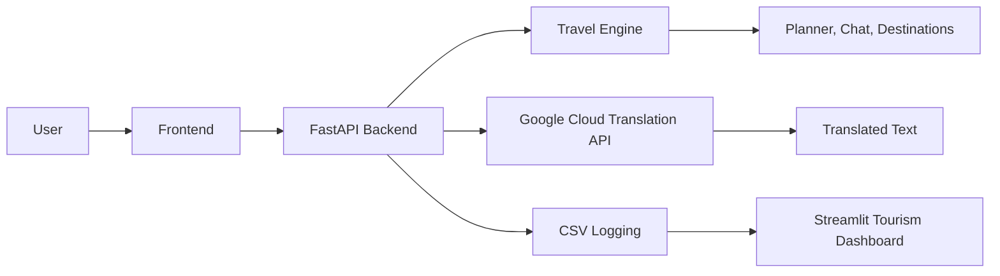

# YatraAI Mega README

YatraAI is an India travel platform with a Python backend, a multi-page frontend, and a tourism-focused Streamlit dashboard.

It includes:

- an India-first travel planner
- AI chat with trip-aware and expert modes
- `Translate` for Indian language translation
- browser speech output for chat and translation
- terminal-only Python audio helpers in `Audio/`
- CSV logging for product analytics
- a tourism dashboard for business and travel insights

## Project Map

- [Frontend](/D:/Yatraai/Frontend)
- [YatraAI](/D:/Yatraai/YatraAI)
- [Audio](/D:/Yatraai/Audio)
- [data](/D:/Yatraai/data)

## How The System Fits Together



## Core Experience

### Frontend

The frontend is a multi-page India travel app:

- Home
- Destinations
- Planner
- Bookings
- Chat
- Translate
- Explorer
- India Map
- Events
- History
- Wishlist
- About
- Privacy

### Backend

The backend:

- serves the frontend
- powers planner and chat
- supports trip-aware or expert-style answers
- proxies translation requests
- writes structured CSV logs

### Dashboard

The Streamlit dashboard is for tourism analysis, not web performance.

It focuses on:

- destination trends across India
- budgets and trip-day patterns
- category and rating signals
- itinerary analysis
- place coverage
- local travel guidance

The dashboard reads the tourism datasets in `data/`.

### Audio

The `Audio/` folder contains standalone Python files for terminal testing:

- speech recognition
- text to speech

These are not connected to the frontend yet.

## Chat And Translation Controls

### Chat

Buttons:

- `New Chat` starts a new conversation
- `Clear All Chats` deletes saved chat sessions
- `Save as Trip` turns the latest answer into a planner trip
- `Open Planner` jumps to the planner screen
- `Trip: Yes` keeps current trip context
- `Trip: No` switches to expert travel mode
- `🎤` shows the mic-unavailable message
- `🔊` reads the latest assistant reply aloud
- `Send` submits the prompt

### Translate

Buttons:

- `🎤` shows the mic-unavailable message
- `Translate` sends the translation request
- `Swap` swaps source and target languages
- `Copy result` copies the translated text
- `🔊` reads the translated result aloud

## Data And Logging

Structured CSV tables are stored in `data/analytics/` for:

- sessions
- queries
- intent parses
- recommendations
- interactions
- conversions
- translations
- chat messages
- general events

The tourism dashboard uses the India tourism datasets in:

- `data/places_dataset.csv`
- `data/hackathon/destinations.json`
- `data/hackathon/itineraries.json`
- `data/hackathon/local_intelligence.json`
- `data/hackathon/cost_benchmarks.json`

## Run Commands

Use `start.bat` from the repo root to start the FastAPI backend and open the app in one step.

```text
D:\Yatraai\start.bat
```

If you want to run the backend manually, use:

```powershell
uvicorn YatraAI.api.app:app --reload --port 8000
```

Copy `.env.example` to `.env`, set `GOOGLE_TRANSLATE_API_KEY`, then start the backend. You can also export it in PowerShell before starting the backend.

## Frontend Notes

The frontend includes:

- route-based navigation
- responsive layouts
- wishlist and history state in browser storage
- polished cards, motion, and travel-style visuals

## Backend Notes

The backend data pack lives in:

```text
D:\Yatraai\data\hackathon
```

The main files are:

- `destinations.json`
- `itineraries.json`
- `local_intelligence.json`
- `cost_benchmarks.json`
- `manifest.json`

## Data Collection Pipeline

The data-collection pipeline builds the place inventory used by the app and dashboard.

It writes into `data/` and is documented in [data_collection/README.md](/D:/Yatraai/data_collection/README.md).

## Translation

The translate page posts to `POST /translate`.

The backend forwards requests to Google Cloud Translation API using the `GOOGLE_TRANSLATE_API_KEY` environment variable.

If translation fails, the backend returns the original text.

## Short Demo Flow

1. Open Home and show the main navigation
2. Open Destinations and compare places
3. Open Planner and generate a route
4. Open Chat and switch between trip mode and expert mode
5. Open Translate and translate Indian languages
6. Open the tourism dashboard and review India trends
